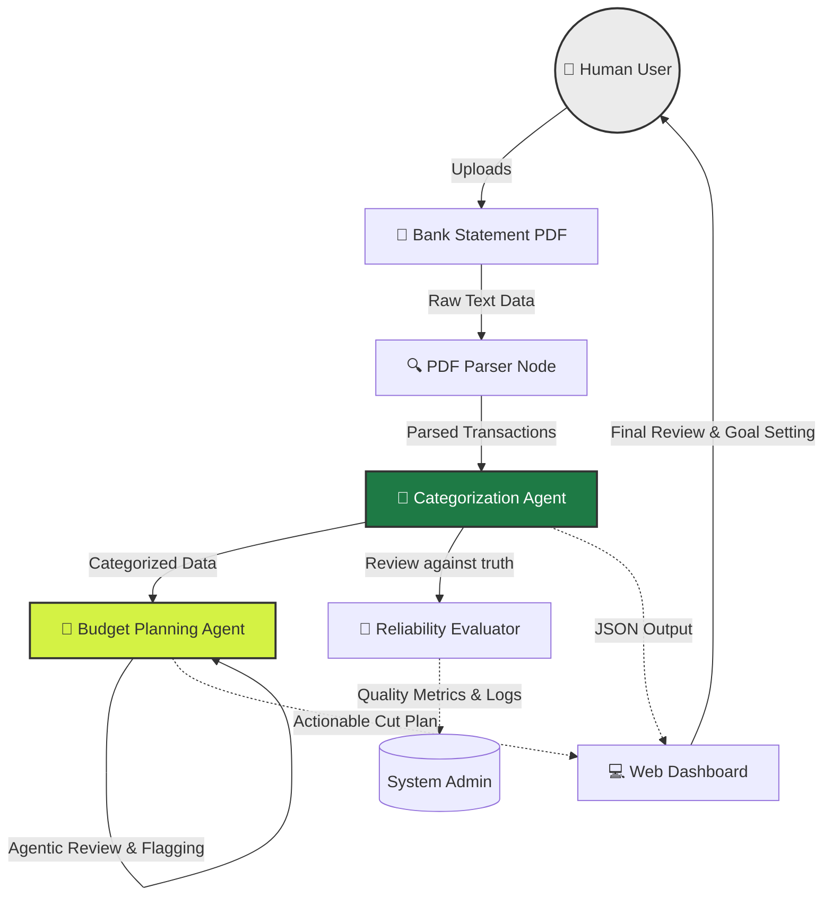

# TrackWise AI Finance Tracker

## Original Project Context
**Original Project Name:** TrackWise Expense Manager
The original project was a standard personal finance dashboard designed to manually track expenses. Its capabilities were limited to uploading CSV data and rendering simple charts to help users visualize where their money was going, requiring users to manually label and categorize their own transactions.

## Title and Summary
**TrackWise AI Finance Tracker** transforms passive expense tracking into an active, intelligent financial assistant. By leveraging large language models (Claude) via an Agentic Workflow, this project eliminates the tedious chore of manual categorization. Simply upload a raw bank statement PDF, and the AI automatically extracts, categorizes, analyzes, and plans. It matters because it bridges the gap between raw data and actionable financial advice—creating a "set it and forget it" experience that dynamically builds personalized budget plans and catches irregular spending without manual human intervention.

## Architecture Overview

The system is built on a Python Flask backend and a dynamic Vanilla JS/CSS frontend interface. The AI pipeline runs sequentially through a series of specialized nodes.

### Components and Data Flow

1. **Input (Retriever Layer):** The user uploads a raw bank statement PDF. `pdf_parser.py` extracts unstructured text and parses it into structured table data (Dates, Descriptions, Amounts).
2. **Process (Categorization Agent):** Data flows to `categorizer.py` where the Claude model acts as a classification agent. It reads the raw descriptions, infers context, and maps them to a set of predefined financial buckets (e.g., *Food & Dining*, *Subscriptions*). 
3. **Advanced Workflow (Budget Planning Agent):** To fulfill the **Agentic Workflow** requirement, the system runs a sequential self-checking agent for savings. Given a user's savings goal:
   - **Plan:** The agent identifies cuttable categories (excluding Rent/Income).
   - **Act:** Proposes strict dollar reductions for specific categories.
   - **Check:** Verifies if the proposed targets mathematically sum up to the goal, and autonomously flags any target requiring an "ambitious" >50% cut.
4. **Output:** The verified JSON data is persisted in a local session and rendered on the frontend dashboard with modern, premium styling (charts, glassmorphism UI, animated cards).

### Human-in-the-Loop & System Testing
* **Reliability Check:** The `reliability_check.py` and `tests/` module acts as our evaluator. It runs rigorous assertions against ground-truth datasets to ensure the AI categorization maintains high accuracy and doesn't hallucinate categories.
* **Human Verification:** On the frontend, humans are involved at the final stage. While the agent autonomously builds the budget plan, the UI explicitly highlights "Agent Verifications" and "Warnings" (e.g., flagging ambitious cuts). The human user acts as the final decision-maker reviewing the AI's proposed financial constraints.
