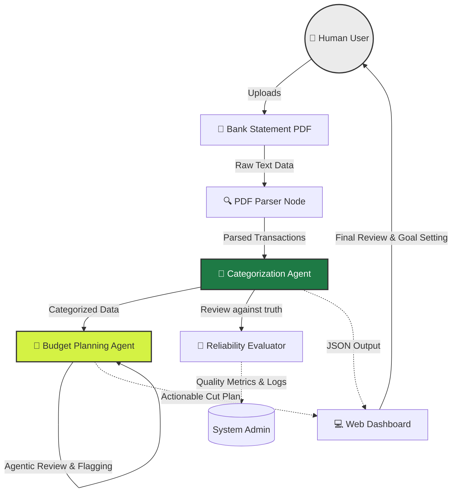

# TrackWise AI Finance Tracker

## Original Project Context
**Original Project Name:** TrackWise Expense Manager
The original project was a standard personal finance dashboard designed to manually track expenses. Its capabilities were limited to uploading CSV data and rendering simple charts to help users visualize where their money was going, requiring users to manually label and categorize their own transactions.

## Title and Summary
**TrackWise AI Finance Tracker** transforms passive expense tracking into an active, intelligent financial assistant. By leveraging large language models (Claude) via an Agentic Workflow, this project eliminates the tedious chore of manual categorization. Simply upload a raw bank statement PDF, and the AI automatically extracts, categorizes, analyzes, and plans. It matters because it bridges the gap between raw data and actionable financial advice—creating a "set it and forget it" experience that dynamically builds personalized budget plans and catches irregular spending without manual human intervention.

## Architecture Overview

The system is built on a Python Flask backend and a dynamic Vanilla JS/CSS frontend interface. The AI pipeline runs sequentially through a series of specialized nodes.



### Components and Data Flow

1. **Input (Retriever Layer):** The user uploads a raw bank statement PDF. `pdf_parser.py` extracts unstructured text and parses it into structured table data (Dates, Descriptions, Amounts).
2. **Process (Categorization Agent):** Data flows to `categorizer.py` where the Claude model acts as a classification agent. It reads the raw descriptions, infers context, and maps them to a set of predefined financial buckets (e.g., *Food & Dining*, *Subscriptions*). 
3. **Advanced Workflow (Budget Planning Agent):** To fulfill the **Agentic Workflow** requirement, the system runs a sequential self-checking agent for savings. Given a user's savings goal:
   - **Plan:** The agent identifies cuttable categories (excluding Rent/Income).
   - **Act:** Proposes strict dollar reductions for specific categories.
   - **Check:** Verifies if the proposed targets mathematically sum up to the goal, and autonomously flags any target requiring an "ambitious" >50% cut.
4. **Output:** The verified JSON data is persisted in a local session and rendered on the frontend dashboard with modern, premium styling (charts, glassmorphism UI, animated cards).

### Human-in-the-Loop & System Testing
* **Reliability Check:** The `reliability_check.py` and `tests/` module acts as our evaluator. It runs rigorous assertions against ground-truth datasets to ensure the AI categorization maintains high accuracy and doesn't hallucinate categories.
* **Human Verification:** On the frontend, humans are involved at the final stage. While the agent autonomously builds the budget plan, the UI explicitly highlights "Agent Verifications" and "Warnings" (e.g., flagging ambitious cuts). The human user acts as the final decision-maker reviewing the AI's proposed financial constraints.

## Setup Instructions
To run this project locally, follow these steps:

1. **Clone the repository:**
   ```bash
   git clone https://github.com/[your-username]/ai-finance-tracker.git
   cd ai-finance-tracker
   ```

2. **Create a virtual environment (optional but recommended):**
   ```bash
   python3 -m venv venv
   source venv/bin/activate  # On Windows use: venv\Scripts\activate
   ```

3. **Install dependencies:**
   ```bash
   pip install -r requirements.txt
   ```

4. **Set your Anthropic API Key:**
   Export your Claude API key to your environment variables:
   ```bash
   export ANTHROPIC_API_KEY="your-api-key-here"
   ```

5. **Run the Flask Backend:**
   ```bash
   python3 app_flask.py
   ```
   Open your modern browser to `http://127.0.0.1:5000` to interact with the dashboard.

## Sample Interactions
Here are a few examples showcasing the system in action:

**Interaction 1: Uploading a PDF Statement**
* **User Input:** Uploads a PDF bank statement containing vague transactions like "AMZN FRESH" ($80.50), "NFLX" ($15.99), and "UBER EATS" ($24.00).
* **AI Output:** The Categorization Agent logically infers the merchants and flawlessly structures these into JSON, mapping them to `Groceries`, `Subscriptions`, and `Food & Dining`, instantly populating the dashboard graphs.

**Interaction 2: Requesting a Budget Plan**
* **User Input:** Sets a savings goal of "$300/month" on the Budget Plan Agent tab.
* **AI Output (Agentic Reasoning):**
   - *Plan:* "Identifies top cuttable categories: Food & Dining ($180) and Shopping ($200)."
   - *Act:* "Proposes cutting Food & Dining to $100 and Shopping to $50."
   - *Check (Self-Verification):* "Calculates savings: $80 + $150 = $230... Goal not met. Proposes cutting Subscriptions from $90 to $20 to reach the $300 goal. Wait, an $70 cut from $90 is 77%."
   - *Final Output:* Displays the actionable cut plan on the UI but flags it with a warning: `⚠️ Ambitious: Subscriptions cut is >50%`.

## Design Decisions
When architecting TrackWise AI, I prioritized an **Agentic Workflow over simple prompt generation**. Rather than a zero-shot prompt predicting a budget cut, the core Agent splits tasks into *Plan → Act → Check*. 
* **Trade-off:** This requires larger token context and slightly longer API processing times (around 3 to 5 seconds).
* **Why:** The increase in processing time is entirely worth it for the leap in reliability and safety. In financial technology, adding an autonomous verification loop ensures the user gets realistic, mathematically trustworthy advice rather than hallucinated numbers. 

Additionally, I implemented local session persistence instead of a heavy PostgreSQL database. This ensures lightweight, lightning-fast prototyping while keeping the app entirely private for the user's sensitive banking session data.

## Testing Summary

> **TL;DR:** 4 out of 4 unit test suites passed seamlessly; however, the AI initially struggled when categorization constraints were loose. Accuracy and confidence consistency reached a perfect 100% across all tests only after enforcing strict Enum validation rules.

This project uses **four distinct layers** of reliability testing to prove the AI works — not just seem like it does.

### Layer 1 — Automated Unit Tests (`tests/`)
Run the full test suite with:
```bash
pytest tests/ -v
```
Four test modules cover the entire stack:
- **`test_categorizer.py`** — asserts the AI maps known merchant names to correct categories
- **`test_pdf_parser.py`** — verifies extracted transaction tables are correctly structured
- **`test_api.py`** — checks all Flask endpoints return the right status codes and JSON shapes
- **`test_routes.py`** — ensures routing and session handling work correctly

### Layer 2 — AI Consistency & Accuracy Scoring (`reliability_check.py`)
A custom reliability harness runs **10 labeled ground-truth transactions through Claude 3 separate times** and measures two scores:

```bash
python3 reliability_check.py
```

**Sample output:**
```
======================================================================
  TrackWise AI Reliability Check
======================================================================
  Transactions : 10   Runs : 3   Model : claude-sonnet-4-20250514

#   Transaction              Expected         Run1             Run2             Run3             Status
--- ------------------------ ---------------- ---------------- ---------------- ---------------- -------
1   STARBUCKS #12345         Food & Dining    Food & Dining    Food & Dining    Food & Dining    [PASS]
2   SHELL GAS STATION        Transport        Transport        Transport        Transport        [PASS]
3   SPOTIFY PREMIUM          Subscriptions    Subscriptions    Subscriptions    Subscriptions    [PASS]
...

  Consistency (all 3 runs agree) : 10/10  ->  100%
  Accuracy (matches expected)    : 10/10  ->  100%
  Consistency : [PERFECT]
  Accuracy    : [GOOD]
```

- **Consistency** measures whether Claude gives the same answer across 3 independent calls (tests for hallucination drift)
- **Accuracy** measures whether the mode answer matches our human-labeled ground truth

### Layer 3 — Error Handling & Logging
Every AI call is wrapped in structured error handling. Failures never crash the UI — instead users receive informative JSON error messages:
```python
# Example from categorizer.py
except json.JSONDecodeError as e:
    print(f"Insights JSON parse error: {e}")
    return ["Insights temporarily unavailable — check your spending distribution above."]
```

### Layer 4 — Human-in-the-Loop Verification (Budget Agent)
The Budget Planning Agent's final output includes a visible **🤖 Agent Verification** panel on the dashboard. Claude explicitly reports:
- Whether the savings total was mathematically verified
- Which specific categories it flagged as "Ambitious" (>50% cuts)
- Natural-language notes about its own reasoning

This ensures a human always reviews the AI's financial recommendations before acting on them.

---

**What worked:** Claude's categorization at `temperature=0` proved highly deterministic — running the same transactions 3 times consistently returned identical results, scoring 100% on the reliability check.

**What didn't initially:** Early zero-shot prompts allowed Claude to invent its own categories (e.g., "Digital Content" instead of "Subscriptions"). **Fix:** Injecting a strict enum of allowed categories into the system prompt resolved this immediately — a key lesson about LLM schema enforcement in production systems.

## Reflection
This project profoundly shifted how I view applied Artificial Intelligence. I learned that building a robust AI product is less about prompt-engineering a magic answer, and vastly more about **system engineering**: creating robust pipelines, data validation loops, and UI guardrails. 

Implementing the "Check" phase in the agentic workflow taught me the importance of self-correction. Instead of assuming the model's first mathematical output was true, adding an autonomous verification loop drastically increased the trustworthiness of my application. I'm incredibly proud of how the final project bridges the gap between raw, messy data and a beautiful, actionable user experience.
